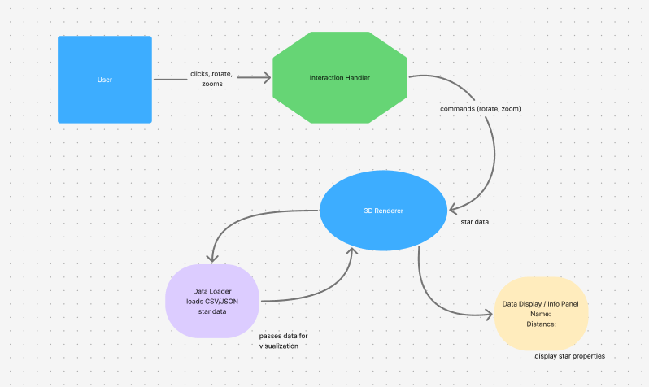

# 🌌 3D Star Catalog Explorer

**Interactive 3D visualization of stars using Three.js and Hipparcos Star Catalog data.**


---

## 📖 Introduction

The **3D Star Catalog Explorer** is a web-based application built with **JavaScript** and **Three.js** that allows users to explore and interact with real astronomical star data from the **Hipparcos Star Catalogue** provided by the **European Space Agency (ESA)**.

Users can rotate, zoom, and select stars to view their properties, while star color and size indicate **spectral type** and **brightness (Vmag)**. This project combines modern web technologies, 3D graphics, and real-world data to create an educational and interactive astronomy tool.

**Keywords:** 3D Visualization, Three.js, Hipparcos, Astronomy, Web Application, Interactive, Star Catalog, ESA

---

## 🏗 System Architecture

The following diagram illustrates how user input and data files flow through the application components:



**Interaction Handler:** Receives clicks, rotations, and zooms; converts them into camera commands.

**3D Renderer:** The core Three.js engine that manages the scene, lighting, and star meshes.

**Data Loader:** Fetches and parses CSV/JSON files, converting astronomical coordinates into 3D vectors.

**Data Display / Info Panel:** A UI layer that updates dynamically when a star is selected by the user.

---

## User Instructions

*Welcome, stargazer! Follow these steps to navigate the cosmos:*

**Launch:** Open the application in a modern browser (Chrome, Firefox, or Edge).

**Rotate:** Click and drag with your mouse to orbit the star field.

**Zoom:** Use the scroll wheel to move closer to or further from star clusters.

**Select:** Click directly on a star to pull up its specific data in the info card.

**Understand the Visuals:**

**Color:** Indicates the star's Spectral Type (Temperature).

**Size:** Indicates the star's Brightness (Vmag).

**Refresh:** If the stars do not appear, refresh the page to re-trigger the Data Loader.

> **Tip:** Explore clusters by zooming in and rotating to see spatial relationships clearly.

---

## 🛠 Developer Instructions

Prerequisites
Because this application loads external data files (CSV/JSON), modern browsers will block it if opened directly as a file (file://). You must use a local development server.

### Installation

### 1. Clone the repository:

```bash
   git clone <repository-url>
   cd 3d-star-catalog-explorer
```

### 2. Project Structure:

```text
   project-root/
├── index.html           # Main HTML entry point
├── style.css            # UI and Info Panel styling
├── main.js              # Core Three.js and Application logic
├── data/
│   └── hipparcos.csv    # Raw Star data
├── scripts/
│   └── csvToJson.js     # Data processing utility
├── assets/              # Images, diagrams, and textures
└── README.md            # Project documentation
```

### 3. Running Locally:

Option A (VS Code): Use the Live Server extension.

Option B (Node.js): Run npx serve . in the root folder.

Option C (Python): Run python -m http.server.

### 4. Extending Features:

To add new features, identify the correct module:

**Rendering:** Update main.js (Scene/Camera).

**Data:** Update data/ or the parsing logic in main.js.

**UI:** Update style.css or the Info Panel section in index.html.

### 5. Debugging Tips

Open Browser DevTools (F12) to check for console errors.

If stars don't load, verify that the path in your fetch() call matches your file structure.
